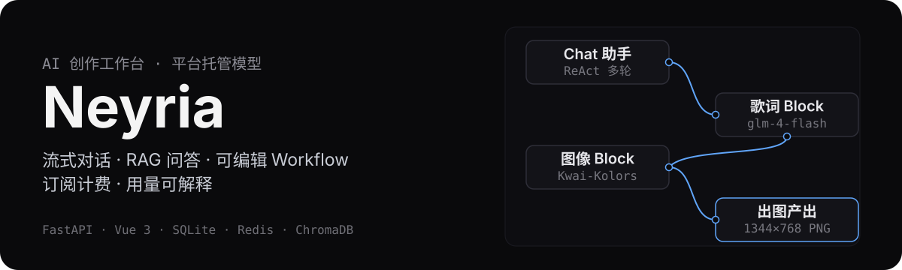
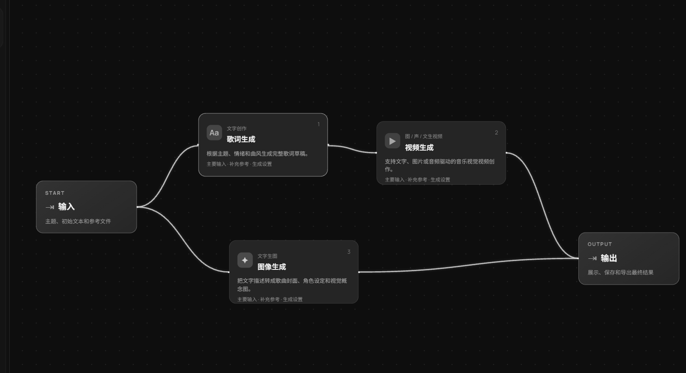
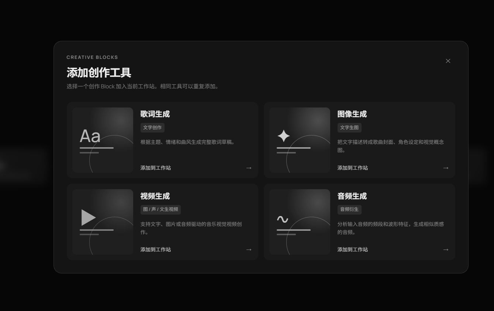
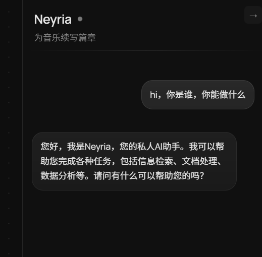
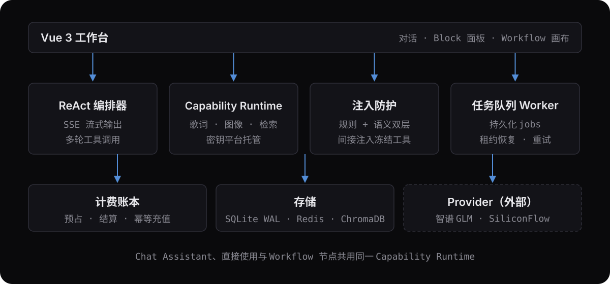

<p align="center">
  
</p>

<p align="center">
  <a href="https://github.com/Cyrivea/Neyria/actions/workflows/ci.yml"></a>
  
  
  
</p>

Neyria 是一个**平台托管模型的 AI 创作工作台**：注册用户开箱即得流式对话助手、项目级 RAG 文档问答、可直接使用的生产工具 Block，以及一份用户与 AI 共同编辑的可执行 Workflow——全程不接触 API Key、上游模型名或系统提示词，模型与密钥只在后端托管。

## 界面一览

<p align="center">
  
</p>

**工作台 · Workflow 画布**：工具 Block 并联编排，节点可拖拽、连线可编辑，运行期间画布自动加锁防止编辑冲突。

<table>
  <tr>
    <td width="50%">
      
      <p align="center"><sub>工具库：一键添加已有创作 Block</sub></p>
    </td>
    <td width="50%">
      
      <p align="center"><sub>Chat Assistant：流式对话 + 工具调用</sub></p>
    </td>
  </tr>
</table>

## 先看证据

| 维度 | 现状 |
| --- | --- |
| 真实生产链 | `lyrics.generate → image.generate` 真机 E2E 出图：SiliconFlow Kolors 生成 1344×768 PNG（含预签名 URL 转存本地），用量入 usage_events 账本 |
| 后端测试 | pytest 250 用例全绿（无密钥环境 230 passed + 1 skipped） |
| 前端测试 | Vitest 46 用例 |
| 意图评测 | 30/30（画布 vs 对话分流） |
| 防注入评测 | 20/20（规则 + 语义双层守卫） |
| 计费并发 | credit ledger 10 线程竞测 0 透支 0 重扣 |
| CI | GitHub Actions 双 job：后端 ruff + mypy + pytest（Redis service 容器）；前端 ESLint + Prettier + Vitest + build |

## 它怎么运作

<p align="center">
  
</p>

- **ReAct 编排器**（`backend/services/chat/`）：SSE 流式输出；按 index 聚合多 tool_calls，结果回填后模型可继续要工具，最多 5 轮；
- **Capability Runtime**（`backend/services/capabilities/`）：生产工具的唯一实现处——Chat Assistant、用户直接使用、Workflow 节点共用同一运行时；歌词走智谱 GLM、图像走 SiliconFlow Kolors、检索 embedding 走 BGE-M3；
- **注入防护**（`backend/core/injection_guard.py`）：规则层先行、语义层过 embedding 前先过门控；RAG 上下文 Spotlighting 打标，间接注入触发工具冻结；
- **任务队列**（`backend/services/job_service.py`）：持久化 jobs/documents，Worker 原子领取 + 租约恢复，失败重试；
- **计费账本**（`backend/services/billing_service.py`）：usage_events 记账 + 价格版本 + reserve/settle/release 预占结算 + CHECK 非负约束 + 幂等充值。

## 快速启动

```bash
# 后端（需要 backend/.env，见下方变量说明）
./dev.sh                 # 自动检查/拉起 Redis + 启动 uvicorn --reload

# 前端
cd frontend
pnpm install
pnpm dev
```

`backend/.env` 至少包含：

```env
SECRET_KEY=...          # JWT 签名密钥
API_KEY=...             # 智谱（聊天与歌词）
SILICONFLOW_API_KEY=... # RAG embedding 与图像
```

可选覆盖：`CHAT_MODEL` / `LYRICS_MODEL`（默认 `glm-4-flash`）、`EMBEDDING_MODEL`（默认 `BAAI/bge-m3`）、`IMAGE_MODEL`（默认 `Kwai-Kolors/Kolors`）。

## 质量门禁

```bash
# 后端（backend/ 目录，依赖管理 uv）
uv sync --all-groups     # 安装含 dev 组的全部依赖
uv run ruff check .      # lint
uv run mypy              # 类型检查
uv run pytest            # 测试

# 前端（frontend/ 目录）
pnpm lint                # ESLint
pnpm format:check        # Prettier
pnpm test                # Vitest
pnpm build               # vue-tsc + vite
```

## 产品边界

- 普通用户不接触 API Key、Base URL、系统提示词或上游模型名；
- 视频、音频 Provider 暂未接入，不做完整多模态；
- 不同时接入多个聊天模型供应商；BYOK 不做。

## 路线图

```text
✅ 平台托管模型和 Provider → ✅ 生产工具 Block（歌词/图像）→ 🔨 订阅、额度和用量计量
→ ✅ 聊天助手调用 Block → 🔨 用户与 AI 共同编辑 Workflow → 🔨 生成结果保存为项目资产
```

> 架构规划见 `architecture.md`（仓库外内部文档）；当前完成度与遗留问题清单见项目内 `unsolved.md`。
